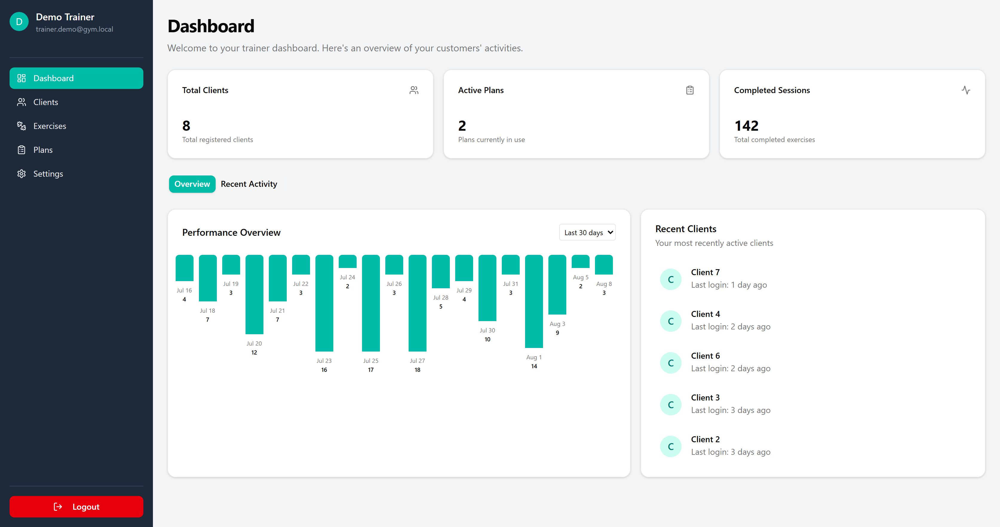
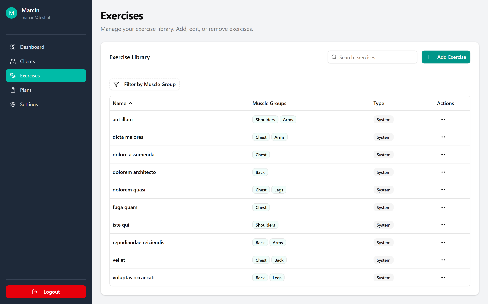
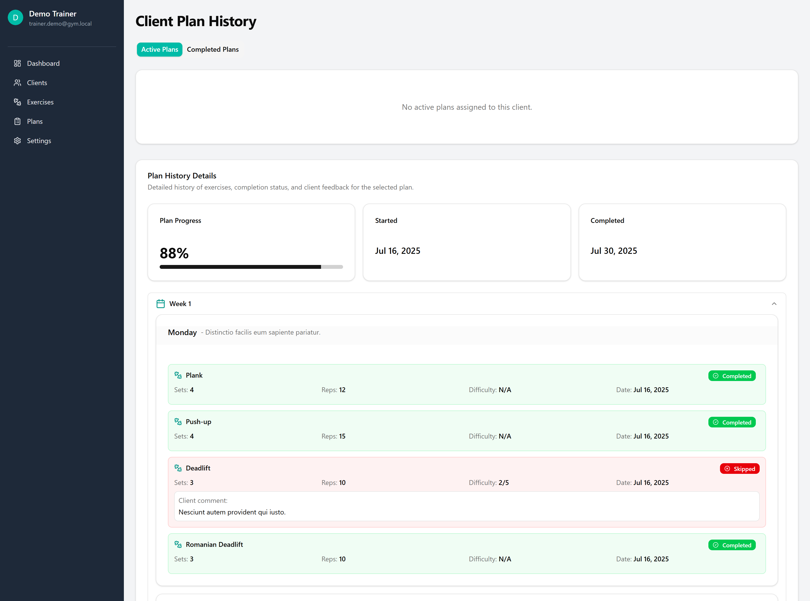
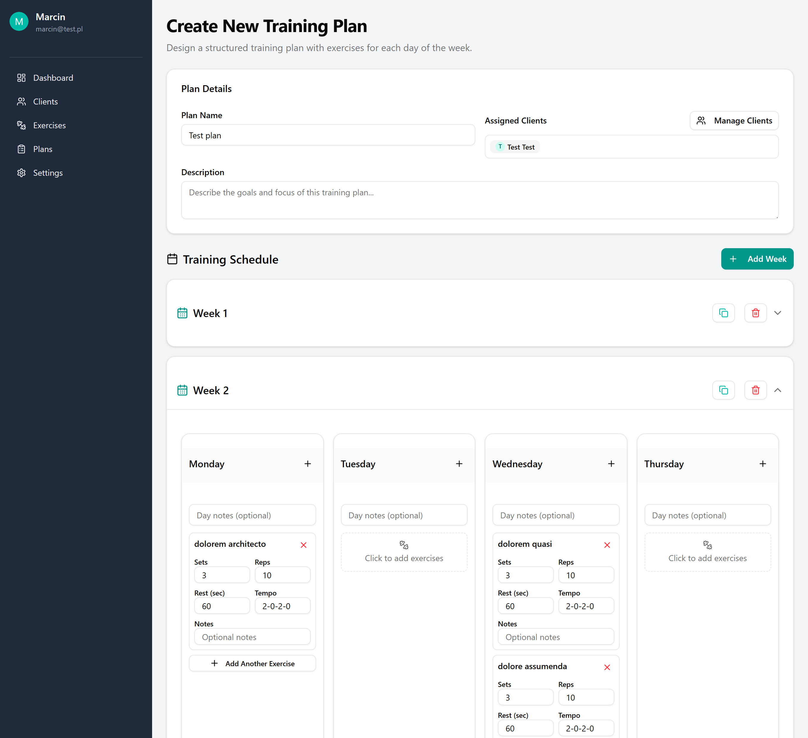
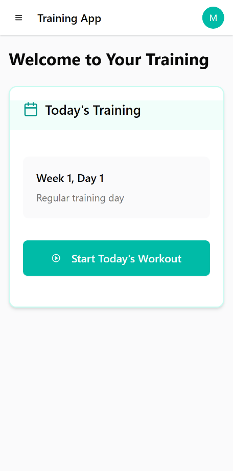
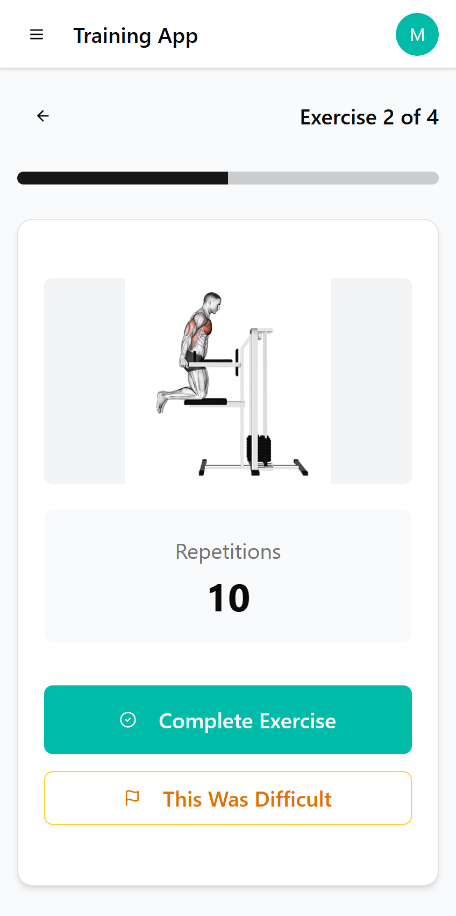
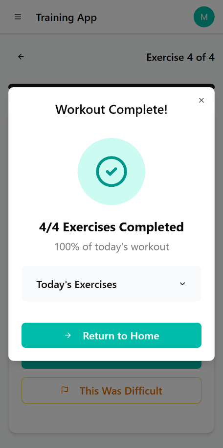

# Gym Planner Web (React + Vite)

A web UI for a personal training platform. **Trainers** manage exercises, clients and plans; **clients** follow daily workouts, complete exercises, and report difficulties. Pairs with the Laravel API.

**Backend repo:** https://github.com/Goferov/gym-planner

---

## Table of Contents

- [Features](#features)
- [Tech Stack](#tech-stack)
- [Project Structure](#project-structure)
- [Environment](#environment)
- [Installation](#installation)
- [Available Scripts](#available-scripts)
- [Routing](#routing)
- [Auth Flow](#auth-flow)
- [Screenshots](#screenshots)
- [Notes](#notes)

---

## Features

**Trainer UI**
- Dashboard with key metrics (total clients, active plans, completed sessions, recent activity).
- Exercises module: list, filter by muscle group, add/edit/remove, media (image/GIF/video link).
- Clients module: list, create/edit, notes/address/phone.
- Plans module: create weekly structures (weeks → days → exercises), assign/unassign to clients, view history.
- Settings: update profile, change password (requires current password).

**Client UI**
- Dashboard: today’s training (or rest/next date), missed workouts list.
- Start today’s workout → complete exercises one by one, or report difficulty (1–5 + comment).
- View history / progress.

---

## Tech Stack

- **React 18** + **Vite**
- **Tailwind CSS 4.1**
- **shadcn/ui** components
- **Axios** (with auth interceptors)
- **React Router v6**
- **date-fns**, **lucide-react** icons

---

## Project Structure

```
src/
  api/
    axios.js                 # base API client + endpoints
  components/
    ui/                      # shadcn/ui components
  context/
    AuthContext.jsx          # token & user state, login/logout
  router/
    AppRouter.jsx
    PublicRoute.jsx
    ProtectedRoute.jsx
  pages/
    Home.jsx
    Auth/
      Login.jsx
      Register.jsx
      Settings.jsx           # profile & password forms
    Trainer/
      TrainerLayout.jsx
      TrainerDashboard.jsx
      ExercisesList.jsx
      ExercisesForm.jsx
      ClientsList.jsx
      ClientsForm.jsx
      PlansList.jsx
      PlanForm.jsx
      ClientPlanHistory.jsx
    Client/
      ClientLayout.jsx
      ClientDashboard.jsx
      Workout.jsx            # step-by-step exercise view
assets/
styles/
```

---

## Environment

Create `.env`:

```dotenv
VITE_API_URL=http://127.0.0.1:8000
```

The Axios client uses `${VITE_API_URL}/api` as base. JWT token is stored in `localStorage` and attached to requests via interceptor.

---

## Installation

```bash
git clone <your-frontend-repo-url>
cd frontend
npm install

# Tailwind v4 is config-less, ensure postcss is present if needed
# npx shadcn@latest init   # if you plan to add more components

npm run dev    # http://127.0.0.1:5173
```

Ensure the backend is running at `VITE_API_URL`.

---

## Available Scripts

- `npm run dev` – start Vite dev server
- `npm run build` – production build
- `npm run preview` – preview build locally
- `npm run lint` – (optional) lint

---

## Routing

- Public routes: `/`, `/login`, `/register`
- Protected (trainer): `/trainer` (dashboard), `/trainer/exercises`, `/trainer/clients`, `/trainer/plans`, `/trainer/settings`, etc.
- Protected (client): `/client` (dashboard), `/client/workout/:planUserId`, `/client/history`, …

`PublicRoute` redirects authenticated users to `/trainer` or `/client` depending on their role. `ProtectedRoute` checks for JWT token and optionally user role.

---

## Auth Flow

1. Login → `POST /api/login` returns `{ token, user }`.
2. Token saved to `localStorage` and injected as `Authorization: Bearer <token>` via Axios interceptor.
3. `getUser` is used to restore session and role-based redirect.
4. Logout → `POST /api/logout` and local state cleanup.

---

## Screenshots

Place screenshots in a `screenshots/` folder and update paths below.

### Trainer Dashboard



### Exercises



### Client history



### Plans



### Client Dashboard



### Workout Flow



### Workout End



---

## Notes

- UI uses **shadcn/ui** primitives with Tailwind; feel free to expand component library.
- Dates are handled with **date-fns**; API returns ISO strings (UTC). Format on the client.
- Axios handles 401 globally (removes token and redirects to `/login`).

---

